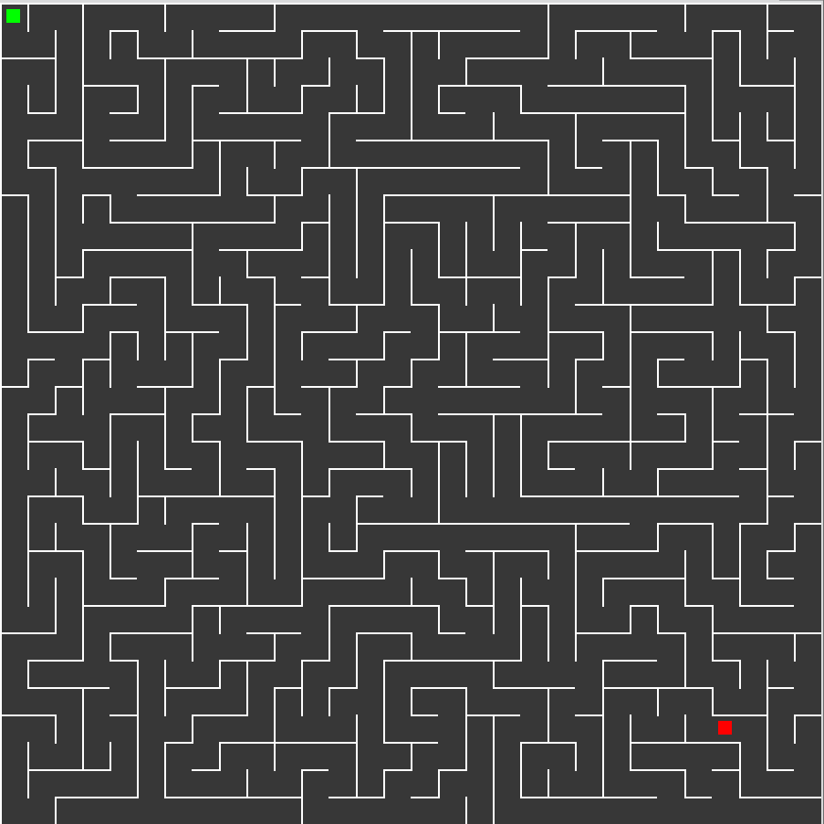

# 2D-MazeGenerator
A 2D maze generator that is based of "Depth-first search" and "Recursive backtracker" algorithms.
This maze has a "difficulty" system, where the user inputs a value [1-100] and based on that, the generated maze will be either harder (the higher the value) or easier (the lower the value). The maze can also be configured manually at the top of the `main.cpp` where some maze attribute variables are listed.

  

## Building the game
### Dependencies
#### Linux - SFML
- If you're on linux you can build the _SFML library_ by yourself following this step-by-step tutorial: https://www.sfml-dev.org/tutorials/2.0/compile-with-cmake.php
    ####or
- You can install it by your package manager (if you use aptitude): ``sudo apt-get install libsfml-dev``

#### Windows/Mac OS
- In Windows or Mac OS, there will be a different procedure which isn't described here yet.

### Required Programs to compile
- You will need a C/C++ compiler (GCC)
- You will need CMake

### CMake
- In order to build the game using the `CMakeLists.txt` you will need to have CMake installed in your  system (``sudo apt-get install cmake``).
- After then you can import this CMake file in your IDE or run it from the terminal with: ``cmake CMakeLists.txt``

### ScreenShot

